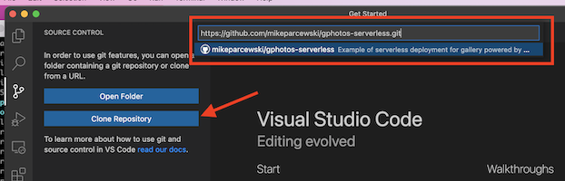
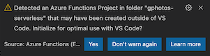
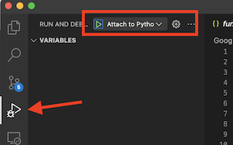
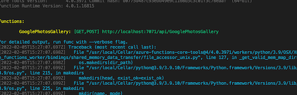
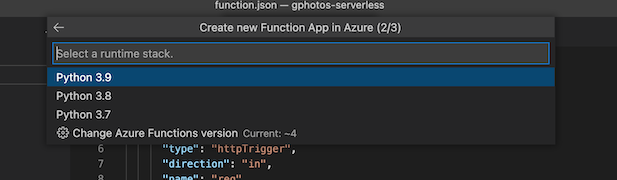
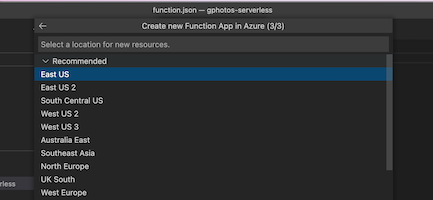
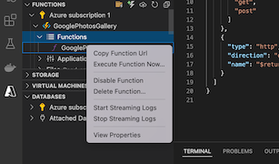

# Google Photos Serverless

Based on on [publicalbum.org](https://www.publicalbum.org/blog/embedding-google-photos-albums)s google photos embed, this python serverless function lets you embed your google photos public albums in your website seamlessly by returning a json payload ready for whatever you can dream up.

### What it does

Parses the HTML page returned from a public google photos album and returns the images as JSON.  This allows you to manage you entire gallery within google photos (add/remove, order, etc...) and embed the gallery or use it within any application easily that supports a JSON payload.

> You could do something similar using google API's, but the setup required seemed more than the 20 lines of code to do this, plus can embed this directly in HTML!

### PreRequisites

* VS Code with Azure Tools extension
* Azure Subscription
* Public Google Photos Album
* The ID for your album (e.g. https://photos.app.goo.gl/Srz7Y8XxxZDm2cfM6 where **Srz7Y8XxxZDm2cfM6** is the ID)

> If you haven't ever deployed a function before to Azure, reccomend reading https://marketplace.visualstudio.com/items?itemName=ms-azuretools.vscode-azurefunctions before you do this.

## Getting Running

For the fastest setup, don’t checkout via command line.  Instead, open [VS Code](https://code.visualstudio.com/) and follow the following steps.

* Clone directly in VS Code
    * Click on “Source Control” in the left column
    
    * Get the link to clone this repo
    
    * Then, click "Clone Repository" and paste the clone url for this repo in entered box
    
* Next, select python 3 environment when it pops up at the top of your screen
  
* Finally, you’ll see a dialog in the bottom corner saying VS “detected Azure Function Project”, click “Yes” on it

### Running locally

* Click on the run/debug icon in the left navigation.  You'll see the "RUN AND DEBUG" panel open to the right, click on the green play button.

* Grab the URL from the terminal window (bottom of IDE)

* In your browser you will need the URL plus the google photos id we created in the last section.
    * Example: http://localhost:7071/api/GooglePhotosGallery?id=Srz7Y8XxxZDm2cfM6

> If you’re building the app you want to embed this in locally, nows the time to start playing with it (for my project I used it with react-stack-grid - https://github.com/tsuyoshiwada/react-stack-grid)

### Deploying

* Open azure panel by clicking on Azure icon in left nav

* Expand "Local Project" under "Functions" and then expand "Functions"

* Click on the cloud icon to deploy

* Click "Create new Function App in Azure" (not the advanced version)

* Enter name for the function and then hit enter

* Choose the runtime stack (3.9)

* Choose region

> This will take a few

### Using Live Function

* Open the Azure panel again

* Expand “Azure Subscription”, expand the function name (e.g. GooglePhotosGallery), and finally expand "Functions" under it.

* Finally click “Copy Function URL” for the live URL

> Honestly, it took me longer to write the README then to develop/deploy the function, but if you're like me and get bored with the standard "Hello World" apps or actually (like me) need this functionality why not :)